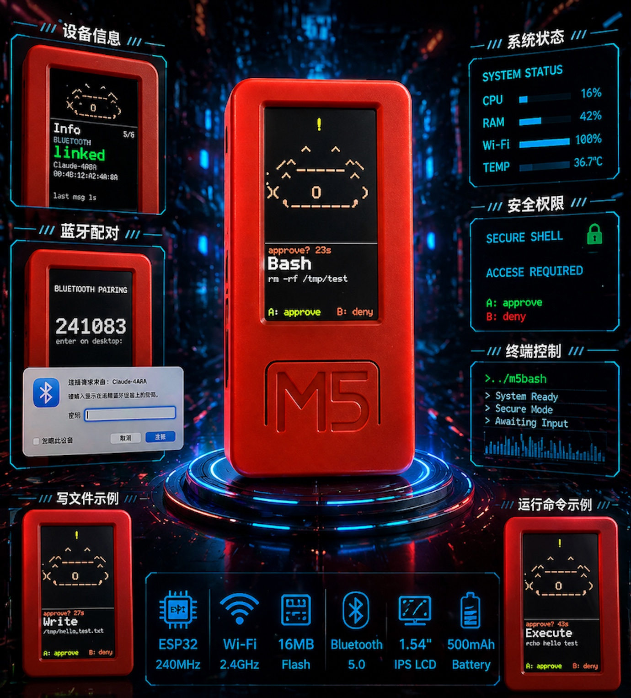
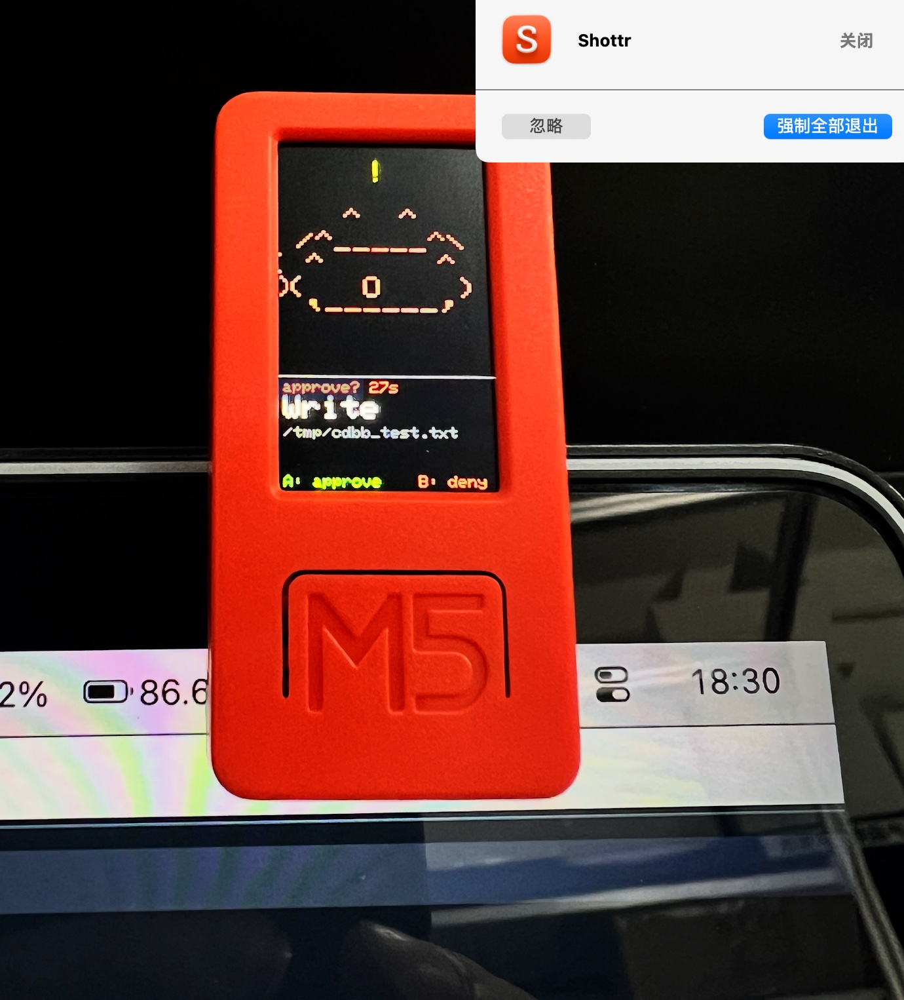
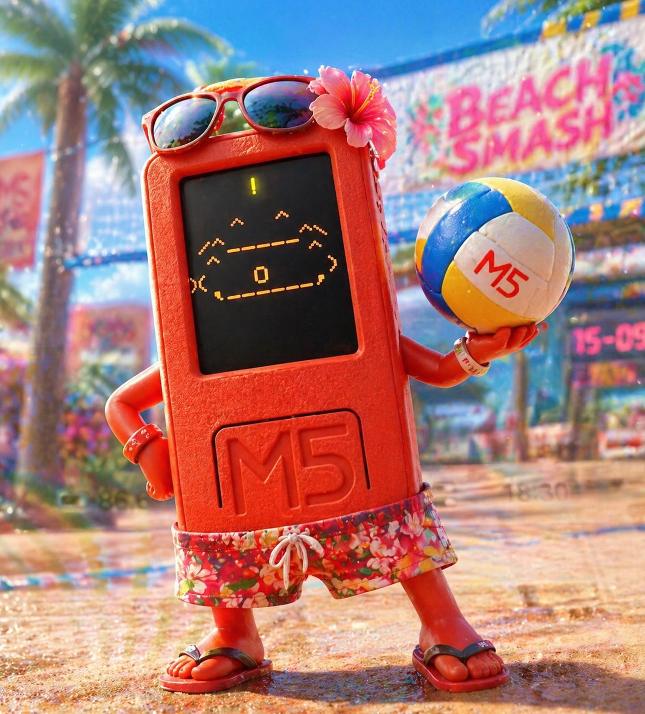
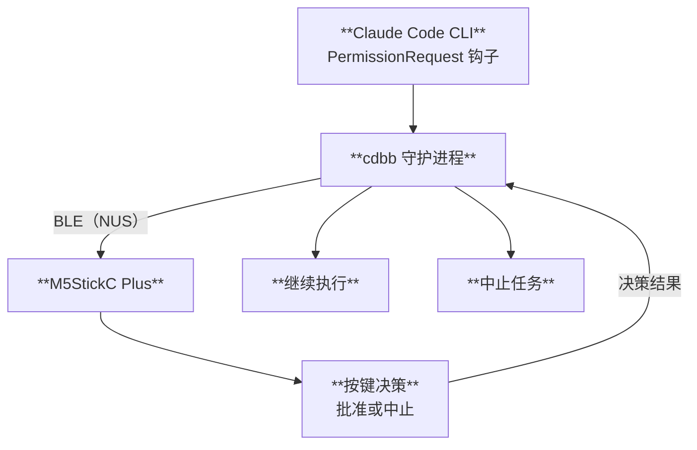

# claude-desktop-buddy-bridge

> 用一块实体小屏幕，按键审批 Claude Code CLI 的每一次敏感操作。

[](https://www.python.org/)
[](LICENSE)
[](https://github.com/astral-sh/uv)

---

<p align="center">
  
  &nbsp;&nbsp;
  
  &nbsp;&nbsp;
  
</p>

Anthropic 的官方 [claude-desktop-buddy](https://github.com/anthropics/claude-desktop-buddy) 固件让 M5StickC Plus 变成 Claude 的物理审批按钮——但它只与**桌面应用**通信，CLI 用户无缘使用。

**claude-desktop-buddy-bridge** 填补这个空缺：一个轻量 Python 守护进程，通过 Claude Code 原生 Hook 系统拦截工具调用，经由 BLE NUS 协议与设备通信，让你用手边的硬件按键来 approve / deny，而不是盯着终端敲 y。



---

## 功能

- **零侵入**：通过 Claude Code 原生 Hook 接入，不需要修改任何项目文件
- **Fail-open**：守护进程未运行时，CC 自动回退到自己的权限对话框
- **自动扫描**：无需手动查找设备地址，自动发现广播名以 `Claude` 开头的设备
- **中文安全**：所有发往设备的字符串自动 sanitize，避免固件点阵字体索引越界崩溃
- **并发串行**：多个并发 hook 请求排队，不会同时争抢设备
- **EOF 竞争检测**：若 CC 提前终止 hook 进程，立即清空设备显示，不会傻等超时
- **心跳自愈**：BLE 链路断开后连续失败退出，由 launchd/systemd 自动重启

---

## 硬件要求

- **M5StickC Plus**，烧录 Anthropic 官方 `claude-desktop-buddy` 固件
- macOS（已测试）或 Linux（需额外蓝牙权限配置，见下文）

---

## 快速开始

### 1. 烧录固件

```bash
git clone https://github.com/anthropics/claude-desktop-buddy
cd claude-desktop-buddy
pio run -t erase && pio run -t upload
```

### 2. 安装 claude-desktop-buddy-bridge

```bash
# 使用 uv（推荐）
uv tool install claude-desktop-buddy-bridge

# 或直接从源码
git clone https://github.com/cuiqingwei/claude-desktop-buddy-bridge
cd claude-desktop-buddy-bridge
uv sync
```

### 3. 注入 Claude Code Hook

```bash
source .venv/bin/activate 
cdbb install
# 只拦截 Bash 工具（更精准）：
# cdbb install --tools Bash
```

这条命令会自动在 `~/.claude/settings.json` 中写入：

```json
{
  "hooks": {
    "PermissionRequest": [
      {
        "hooks": [
          {
            "type": "command",
            "command": "/path/to/cdbb-hook",
            "timeout": 120
          }
        ]
      }
    ]
  }
}
```

在 command 前面插入一行 

```json
 "matcher": "Bash",
```

### 4. 启动守护进程

```bash
cdbb daemon
```

手动扫描并连接附近的 M5StickC Plus 设备(已经配对过的需要提前先忽略忘记设备)。

```bash
cdbb scan  
```
正常会得到如下结果：

```bash
cdbb scan    

正在扫描 BLE 设备（10 秒）…

F6DBFCE4-2CCB-AD5F-F6DD-3FFED230D9D0  Claude Buddy  ◀ cdbb 兼容
```


如果有多台设备或想跳过扫描：

```bash
CDBB_ADDR=F6DBFCE4-2CCB-AD5F-F6DD-3FFED230D9D0 cdbb daemon
```

### 5. 使用

打开 Claude Code，触发一个需要审批的操作（如执行 Bash 命令）：

- **M5 正面按钮** → 批准（`allow`）
- **M5 侧面按钮** → 拒绝（`deny`）

设备不在手边？cdbb 超时后自动 fail-open，CC 弹出自己的对话框。

---

## 常用命令

| 命令 | 说明 |
|------|------|
| `cdbb scan` | 扫描附近的 Claude BLE 设备 |
| `cdbb install` | 注入 hook 到 Claude Code 配置 |
| `cdbb install --tools Bash Write` | 只拦截指定工具 |
| `cdbb daemon` | 启动守护进程 |
| `cdbb daemon -v` | 调试模式（显示详细日志） |
| `cdbb status` | 检查守护进程是否在线 |
| `cdbb uninstall` | 移除 hook 配置 |

---

## macOS 开机自启（launchd）

```bash
# 先确认 cdbb 安装路径
which cdbb

# 编辑 plist，将路径替换为上一步的输出
cp extras/dev.cdbb.daemon.plist ~/Library/LaunchAgents/
# 编辑文件，修改 ProgramArguments 中的路径

launchctl load ~/Library/LaunchAgents/dev.cdbb.daemon.plist
```

卸载：

```bash
launchctl unload ~/Library/LaunchAgents/dev.cdbb.daemon.plist
rm ~/Library/LaunchAgents/dev.cdbb.daemon.plist
```

---

## Linux 蓝牙权限

Linux 上默认需要 root 才能访问 BLE。推荐方式：

```bash
sudo setcap cap_net_raw+eip $(which python3)
# 或者指定 venv 里的 python
sudo setcap cap_net_raw+eip $(uv run which python)
```

---

## 环境变量

| 变量 | 说明 |
|------|------|
| `CDBB_ADDR` | 直接指定 BLE 设备地址，跳过扫描（如 `00:4B:12:A2:4A:8A`） |

---

## 已知固件问题（claude-desktop-buddy）

以下是官方固件的已知 bug，claude-desktop-buddy-bridge 在代码层面已全部处理：

| 问题 | cdbb 处理方式 |
|------|-------------------|
| 5×7 点阵字体不支持 UTF-8，非 ASCII 字节导致蓝牙栈约 1 秒内硬重置 | 所有字符串通过 `sanitize()` 替换为 `?` |
| `entries` 字段固件期望最旧在前，而非最新在前 | `snapshot()` 中 `reversed()` 处理 |

---

## 开发

```bash
git clone https://github.com/cuiqingwei/claude-desktop-buddy-bridge
cd claude-desktop-buddy-bridge
uv sync --extra dev

# 运行测试
uv run pytest

# 直接运行
uv run cdbb scan
uv run cdbb daemon -v
```

### 项目结构

```
cdbb/
├── src/cdbb/
│   ├── __init__.py     版本号
│   ├── bridge.py       守护进程核心（BLE 通信 + Unix Socket 服务器）
│   ├── hook.py         被 Claude Code 调用的 hook 脚本
│   └── cli.py          命令行入口（daemon / scan / install / status）
├── tests/
│   └── test_bridge.py  单元测试
├── extras/
│   └── dev.cdbb.daemon.plist   macOS launchd 配置模板
├── pyproject.toml
└── README.md
```

---

## 致谢

BLE 线协议、固件及硬件设计均来自 Anthropic 的 [claude-desktop-buddy](https://github.com/anthropics/claude-desktop-buddy)。

核心架构设计参考了 [CharmYue/cc-buddy-bridge](https://github.com/CharmYue/cc-buddy-bridge)——尤其是 EOF 竞争检测、permission_lock 串行化和 fail-open 设计，是目前社区实现中工程质量最高的版本。

---

## License

[MIT](LICENSE)
